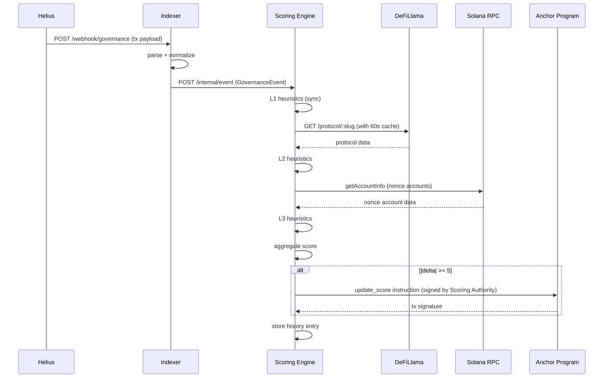

# STPS — Arquitetura do Sistema

## Visão Geral

O STPS é um sistema distribuído composto por 4 componentes principais que se comunicam de forma assíncrona e síncrona. O fluxo de dados vai de eventos on-chain na Solana até um certificado de confiança verificável também on-chain, passando por um pipeline de processamento off-chain.

---

## Diagrama de Arquitetura Completo

```mermaid
flowchart TD
    subgraph Solana["☀️ Solana Network"]
        SC["Squads / SPL Governance\nPrograms"]
        NA["Nonce Accounts\n(admin keys)"]
        AP["Anchor Program\nProtocolCertificate PDA"]
    end

    subgraph Helius["🌐 Helius"]
        HW["Helius Webhook\n(parsed transactions)"]
    end

    subgraph Indexer["📡 Indexer  packages/indexer"]
        WH["POST /webhook/governance"]
        P1["parser: squads.ts"]
        P2["parser: spl-governance.ts"]
        P3["parser: nonce.ts"]
        EM["emitter.ts"]
    end

    subgraph Scoring["🧮 Scoring Engine  packages/scoring"]
        IE["POST /internal/event"]
        L1["Layer 1: Governance"]
        L2["Layer 2: Asset Legitimacy"]
        L3["Layer 3: Nonce Watchdog"]
        AG["aggregator.ts\nnewScore + risk_flags"]
        OC["on-chain.ts\nsubmit update_score"]
        API["REST API\nGET /api/score/:id"]
    end

    subgraph External["🌍 External APIs"]
        DL["DeFiLlama API\n(60s cache)"]
        RPC["Solana RPC\n(Helius)"]
    end

    subgraph Consumers["📱 Consumers"]
        FE["Frontend\napps/dashboard"]
        SDK["SDK\n@stps/sdk"]
    end

    SC -->|transaction| HW
    NA -->|nonceAdvance| HW
    HW --> WH
    WH --> P1 & P2 & P3
    P1 & P2 & P3 --> EM
    EM -->|GovernanceEvent| IE
    IE --> L1
    L1 --> L2 --> L3 --> AG
    L2 -.->|fetch| DL
    L3 -.->|fetch nonce accounts| RPC
    AG -->|if delta >= 5| OC
    OC -->|update_score tx| AP
    AP -->|PDA updated| RPC
    API -->|read PDA| RPC
    FE -->|GET /api/score/:id| API
    SDK -->|getScore()| API
```

---

## Componentes e Responsabilidades

### 1. Anchor Program (`programs/stps/`)

**Responsabilidade única:** Ser a fonte de verdade on-chain para o Trust Score.

- Armazena `ProtocolCertificate` PDAs (uma por protocolo)
- Armazena `WalletReputation` PDAs (uma por signatário de multisig)
- Valida que **somente** a Scoring Authority pode alterar os dados
- Emite eventos `ScoreUpdated` e `AlertFlagged` para indexação

**Fronteira de responsabilidade:** O programa Anchor **não calcula** o score — ele apenas persiste o resultado calculado off-chain. A lógica de negócio vive no Scoring Engine.

### 2. Indexer (`packages/indexer/`)

**Responsabilidade única:** Ingerir eventos on-chain e normalizá-los.

- Recebe webhooks do Helius com transações parsed
- Filtra eventos relevantes por Program ID (Squads, SPL Gov, System Program)
- Normaliza para a interface `GovernanceEvent`
- Encaminha ao Scoring Engine via HTTP POST interno

**Fronteira de responsabilidade:** O Indexer **não calcula scores**. Ele só normaliza e encaminha.

### 3. Scoring Engine (`packages/scoring/`)

**Responsabilidade única:** Calcular o Trust Score e submeter atualizações on-chain.

- Mantém um store in-memory de scores e histórico (MVP sem banco de dados)
- Executa o algoritmo de 3 camadas a cada evento recebido
- Consulta DeFiLlama (L2) e Solana RPC (L3) como parte do cálculo
- Submete `update_score` on-chain apenas quando `|Δ| ≥ 5`
- Expõe a API REST pública para o frontend e SDK

**Fronteira de responsabilidade:** O Scoring Engine **não parseia** transações raw — recebe apenas `GovernanceEvent` normalizados.

### 4. Frontend (`apps/dashboard/`)

**Responsabilidade única:** Visualizar os scores de forma clara e alarmante.

- Lê dados do Scoring Engine via API REST (não diretamente da chain para UX)
- Renderiza o histórico de score com Recharts
- Exibe alertas de flags ativas
- Implementa o case study do Drift como prova de conceito

### 5. SDK (`packages/sdk/`)

**Responsabilidade única:** Facilitar integração por terceiros.

- Wrapper sobre a API REST do Scoring Engine
- Expõe `getScore()`, `getHistory()`, `subscribeToAlerts()`
- Publicado como `@stps/sdk` no NPM

---

## Fluxo de Dados — Exemplo Completo (Caso Drift)

```
t=0s    Squads Program emite tx: threshold 3/5 → 2/5
t=0.1s  Helius detecta e envia webhook ao Indexer
t=0.5s  Indexer parseia → GovernanceEvent { type: "MULTISIG_THRESHOLD_CHANGED" }
t=0.6s  Scoring Engine recebe evento → executa L1: -20pts (FLAG_MULTISIG_THRESHOLD_LOWERED)
t=0.7s  L2: DeFiLlama OK → 0pts. L3: sem nonces → 0pts
t=0.8s  Score: 85 → 65. |Δ|=20 ≥ 5 → submete update_score on-chain
t=5s    Transação confirmada na Devnet. PDA atualizado: score=65, flags=0b0000_0010
t=5.1s  Frontend polled → exibe score 65, badge "Medium ⚠️"

t=12h   Admin remove timelock via tx de governança
        Fluxo repete → score: 65 → 42. Badge: "High 🔴"
        Alert banner: "Timelock removed — emergency migration detected"
```

---

## Decisões Arquiteturais

### Por que TypeScript em vez de Python para o backend?

Uma única runtime (Node.js/TypeScript) para Indexer, Scoring Engine e SDK significa:
- Tipos compartilhados entre todos os componentes via interfaces TypeScript
- Sem overhead de manter dois ambientes de execução
- O Helius SDK, Anchor JS e @solana/web3.js são todos TypeScript-nativos

### Por que store in-memory em vez de banco de dados?

Para o MVP do hackathon, um Map em memória no Scoring Engine é suficiente. Não há necessidade de persistência entre restarts durante o demo. O on-chain PDA é a fonte de verdade real — o histórico off-chain é apenas para o gráfico do frontend.

Se o projeto evoluir para produção: substituir por PostgreSQL + Prisma ou Redis para histórico.

### Por que threshold `|Δ| ≥ 5` para updates on-chain?

Cada transação on-chain tem custo (lamports) e latência (~5-30s para confirmação). Filtrar updates menores que 5 pontos reduz custos e evita sobrecarga de transações sem impacto significativo na experiência do usuário.

### Por que não ler o score diretamente da chain no frontend?

A latência de confirmação on-chain (~5-30s) mais a latência de RPC cria uma UX ruim para polling. O Scoring Engine serve como cache HTTP com TTL de 30s via Next.js ISR — muito mais rápido. O on-chain PDA continua sendo a fonte verificável para o SDK e integrações externas.

---

## Interfaces de Comunicação entre Componentes

| De | Para | Protocolo | Endpoint/Método |
| :--- | :--- | :--- | :--- |
| Helius | Indexer | HTTP POST | `/webhook/governance` |
| Indexer | Scoring Engine | HTTP POST | `/internal/event` |
| Scoring Engine | Anchor Program | Solana Transaction | `update_score` instruction |
| Frontend | Scoring Engine | HTTP GET | `/api/score/:id`, `/api/protocols` |
| SDK | Scoring Engine | HTTP GET | `/api/score/:id` |

---

## Diagrama de Sequência — Score Update


